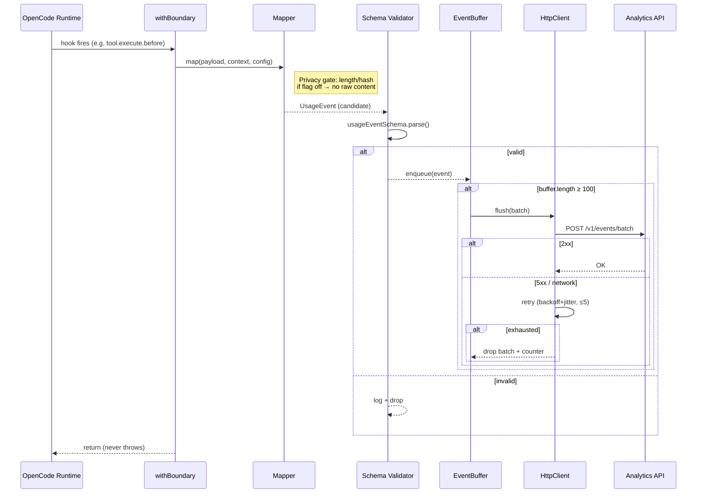

# Design: OpenCode Usage Collector Plugin

## Technical Approach

Pure-domain mappers/config + infrastructure injected via plugin closure. Hook handlers wrapped in try/catch boundary. Events validated pre-enqueue against `usageEventSchema` (zod v4). Buffer drains via plain fetch + AbortController. Layered config (env > JSON > defaults) resolved at startup into a frozen object. TS-source-first: Bun executes raw `.ts`; no build step for v1.

## Architecture Decisions

| Decision | Options | Choice | Rationale | Spec Trace |
|---|---|---|---|---|
| Module topology | Flat single file; layered (mappers/infra/entry) | **Layered** — 7 source files across 3 layers | Clean Architecture separation; mappers stay pure/testable; infra injected | Non-Blocking Guarantee, Mapper Correctness |
| Domain/infra boundary | Mappers import infra; infra imports mappers | **Domain pure, infra injected** via closure | Mappers testable without mocks; config never leaks into domain | Tested Contract |
| Session root resolution | Client.session lookup; ancestor walk over parentID edges | **Ancestor walk** (Map parent→child edges) | Zero async at mapping time; client calls only at idle reconciliation | Subagent attribution scenario |
| callID staging map | WeakMap on objects; plain `Map<string, ToolCall>` | **`Map<string, ToolCall>`** keyed by callID string | callID is a string ID, not an object ref; Map is simpler | tool.execute.before/after |
| Last-write-wins policy | Merge partial fields; last-write-wins | **Last-write-wins per key** | Stateless mappers; each payload carries full state at that point | Ordering tolerance uncertainty |
| Privacy computation site | Mapper level; buffer enqueue; validation step | **Mapper level** (inline at map time) | Closest to source; no raw content leaks past mapper boundary | Privacy Gating |
| Length encoding | `string.length` (UTF-16); TextEncoder UTF-8 bytes | **TextEncoder UTF-8 bytes** | Spec says "UTF-8 byte length"; TextEncoder is native | Privacy Gating, Defaults redact scenario |
| Hash function | node:crypto async; node:crypto sync `createHash` | **`createHash('sha256')` sync, `.digest('hex')`** | Sync is fine for short strings; no I/O needed; zero dep | Privacy Gating |
| Buffer data structure | Ring buffer; plain `Array` | **`Array<UsageEvent>`** with shift() on overflow | 10k max; shift is O(n) but negligible at this scale; no dep | Buffering and Delivery |
| Timer mechanism | `setInterval`; recursive `setTimeout` | **`setInterval(fn, 1000)`** cleared on dispose | Boring, predictable; no unref needed — plugin lifetime = process lifetime | Buffering and Delivery |
| HTTP transport | axios; got; native fetch | **Native `globalThis.fetch`** | Zero dep; native in Bun; AbortController built-in | Buffering and Delivery |
| Retry scheduler | Fixed delay; exponential backoff+jitter | **Exponential backoff: base=200ms, cap=10s, jitter=±50%** | Bounded retry window; jitter prevents thundering herd | Buffering and Delivery |
| Abort timeout | 5s; 10s; 30s | **10s** per POST attempt | Generous for batch POST; prevents hung connections | Buffering and Delivery |
| Config schema location | In index.ts; separate `config-schema.ts` | **`src/domain/config-schema.ts`** (pure zod + DEFAULTS) | Domain stays pure; index.ts does I/O only at bootstrap | Configuration Resolution |
| Env var names | Undecided | `OPENCODE_ANALYTICS_URL`, `OPENCODE_ANALYTICS_API_KEY`, `OPENCODE_ANALYTICS_USER`, `OPENCODE_ANALYTICS_DISABLED` | Self-documenting; matches `OPENCODE_*` convention from docs | Configuration Resolution |
| Capture flags naming | `privacy.*`; `capture.*` | **`capture.prompts`, `capture.responses`, `capture.toolArguments`** | User-facing semantics ("capture" not "privacy"); matches exploration | Privacy Gating |
| Error boundary pattern | Try/catch per hook; try/catch wrapper function | **`withBoundary(fn, client)` helper** returning `(...args) => { try { fn(...args) } catch(e) { count++; log } }` | Single reusable wrapper; guaranteed no throw escapes | Non-Blocking Guarantee, Throwing mapper scenario |
| Buffer queue bound | 5k; 10k; 50k | **10,000 events** with drop-oldest + counter | Matches spec exactly | Buffering and Delivery, Overflow scenario |
| Idle memory cleanup | None; session.idle evicts; time-based TTL | **session.idle triggers reconciliation pass + staged state eviction** | Aligns with spec idle-flush trigger; reclaims stale state | Buffering and Delivery |
| tool.execute.after shape tolerance | Strict destructuring; tolerant drop-with-counter | **Tolerant: accept known fields, drop unknowns, increment counter** | Spec flags this uncertainty; crash-free | Non-Blocking Guarantee |

## Data Flow

```
Hook fires → withBoundary wrap → mapper(payload, context, config) →
  usageEventSchema.parse() → valid: enqueue | invalid: log+drop →
  buffer.length ≥ 100 OR 1s tick OR session.idle OR dispose →
  flush(): slice buffer → POST /v1/events/batch (X-API-Key) →
    2xx: done | 4xx: drop batch + counter | 5xx/network: retry ≤5 → drop + counter
```

## Correlation State Model

```typescript
interface ExecutionContext {
  sessionId: string;
  traceId: string;        // root ancestor
  parentId?: string;      // from session.created parentID
  agentName?: string;     // resolved from first UserMessage
}

interface ToolCall {
  callID: string;
  toolName: string;
  startTime: number;
  endTime?: number;
  status?: 'success' | 'error';
}

// State held in plugin closure:
executions: Map<string, ExecutionContext>;   // sessionId → context
toolCalls: Map<string, ToolCall>;           // callID → state
config: CollectorConfig;                    // frozen at startup
counters: { dropped: number; retried: number; errors: number };
```

Session root resolution: `session.created` handler walks `parentID` chain using a `Map<string, string>` of observed `childID→parentID` edges. If no parentID, `traceId = session.id`. If parentID present, recurse up until an entry with no parentID is found — that is the root.

Memory bounds: `executions` Map capped at 1,000 entries; `session.idle` evicts the target session's staged state after reconciliation. `toolCalls` evicts completed entries when the associated execution is evicted.

## Defensive Boundary

```typescript
function withBoundary<T extends (...args: unknown[]) => void>(
  fn: T,
  client: PluginClient,
): T {
  let errorCount = 0;
  return ((...args: unknown[]) => {
    try {
      fn(...args);
    } catch (err) {
      errorCount++;
      if (errorCount <= 3) {
        client.app.log({
          body: {
            service: 'opencode-collector',
            level: 'error',
            message: `Hook error #${errorCount}: ${err instanceof Error ? err.message : String(err)}`,
          },
        });
      }
    }
  }) as T;
}
```

- Errors counted; first 3 logged, then suppressed to avoid log spam.
- Counter surfaced in periodic heartbeat log.

## Privacy Pipeline

Privacy gating happens **inside each mapper function**, before any event object is constructed:

```typescript
function computePromptPrivacy(text: string, capturePrompts: boolean): {
  prompt?: string; promptLength: number; promptHash: string;
} {
  const encoder = new TextEncoder();
  const bytes = encoder.encode(text);
  const hash = createHash('sha256').update(bytes).digest('hex');
  return capturePrompts
    ? { prompt: text, promptLength: bytes.length, promptHash: hash }
    : { promptLength: bytes.length, promptHash: hash };
}
```

Pure function, no I/O. `createHash` imported from `node:crypto` (sync, zero dep). The mapper never passes raw content past this gate.

## Buffer & HTTP Client

**Buffer**: `Array<UsageEvent>` + `setInterval(flush, 1000)`. On enqueue: if `length ≥ 10000`, shift oldest + increment `counters.dropped` (queue bound). Flush triggered by: (1) enqueue pushes length to ≥ 100 (flush threshold — distinct from the 10k queue bound), (2) 1s timer tick, (3) `session.idle` hook, (4) `dispose` hook.

**HTTP client**: Injected `fetchFn` and `clockFn` for test seams. POST body `{ events: UsageEvent[] }`. Header `X-API-Key: ${config.apiKey}`.

Retry: `setTimeout` with exponential backoff. `base = 200ms`, `cap = 10_000ms`, `attempt = min(base * 2^i, cap)`, `jitter = attempt * (Math.random() - 0.5)`. Max 5 attempts per batch. Each attempt uses `AbortController` with 10s timeout. On final failure: drop batch + increment `counters.retried`.

Injection seams:
```typescript
interface HttpClientDeps {
  fetchFn: typeof fetch;
  clockFn: () => number; // Date.now replacement
}
```

## Config Module

`src/domain/config-schema.ts` — pure zod schema, zero I/O:

```typescript
import { z } from 'zod';

const captureSchema = z.object({
  prompts: z.boolean().default(false),
  responses: z.boolean().default(false),
  toolArguments: z.boolean().default(false),
});

const collectorConfigSchema = z.object({
  url: z.string().url().optional(),
  apiKey: z.string().optional(),
  userId: z.string().optional(),
  capture: captureSchema.default({}),
  disabled: z.boolean().default(false),
});

export type CollectorConfig = z.infer<typeof collectorConfigSchema>;
```

Resolution in `index.ts` bootstrap (I/O boundary):
1. Read env vars into a partial object.
2. Read `.opencode/analytics.json` `.collector` section if file exists.
3. Merge: `env > file > defaults` via spread (later wins).
4. Parse through `collectorConfigSchema`.
5. If `url` is missing after parse → set `disabled = true`, log once.

Note: zod schema fields are `.optional()` for graceful parse; "Required" in the spec means "required for operational enablement" — the validation layer at step 5 enforces this, not the schema itself. This is correct: a missing endpoint disables the collector (non-blocking), while missing apiKey/userId emit events without auth/actor identity (degraded but non-crashing).

Env var names (exact):
- `OPENCODE_ANALYTICS_URL`
- `OPENCODE_ANALYTICS_API_KEY`
- `OPENCODE_ANALYTICS_USER`
- `OPENCODE_ANALYTICS_DISABLED` (optional; `"true"` disables)

## Dogfood Shim

`.opencode/plugins/analytics.ts`:
```typescript
export { createPlugin as AgentAnalyticsPlugin } from '../../packages/opencode-collector/src/index.ts';
```

Bun resolves `../../packages/opencode-collector/src/index.ts` relative to the shim file when OpenCode runs inside this repo. The workspace `package.json` `"main"` field is not used here — the shim imports the TS source directly via relative path. This works because Bun executes raw TS with no resolution boundary.

## Sequence Diagram



## File Changes

| File | Action | Description |
|---|---|---|
| `packages/opencode-collector/src/index.ts` | Replace | Plugin entry: bootstrap config, register hooks, self-check log |
| `packages/opencode-collector/src/domain/config-schema.ts` | Create | Pure zod schema + CollectorConfig type + DEFAULTS |
| `packages/opencode-collector/src/domain/types.ts` | Create | ExecutionContext, ToolCall, internal state types |
| `packages/opencode-collector/src/mappers/session-mapper.ts` | Create | session.created → ExecutionContext staging |
| `packages/opencode-collector/src/mappers/message-mapper.ts` | Create | user/assistant message → UsageEvent (prompt, model-call) |
| `packages/opencode-collector/src/mappers/tool-skill-mapper.ts` | Create | tool.before/after + skill detection + ToolPart → UsageEvent |
| `packages/opencode-collector/src/infra/event-buffer.ts` | Create | Bounded array + flush triggers + drop/retry counters |
| `packages/opencode-collector/src/infra/http-client.ts` | Create | fetch POST + AbortController + retry scheduler |
| `packages/opencode-collector/src/infra/boundary.ts` | Create | `withBoundary` helper |
| `packages/opencode-collector/src/fixtures/opencode-payloads.ts` | Create | Typed fixture payloads per Gap-3 table rows |
| `packages/opencode-collector/src/__tests__/mappers.test.ts` | Create | Table-driven fixture mapper tests |
| `packages/opencode-collector/src/__tests__/buffer.test.ts` | Create | Fake-timer + injected-fetch buffer/flush/retry tests |
| `packages/opencode-collector/src/__tests__/smoke.test.ts` | Create | Optional: mock HTTP server + `describe.skipIf` guard |
| `.opencode/plugins/analytics.ts` | Create | Dogfood shim: re-export plugin factory |

## Testing Strategy

| Layer | What to Test | Approach |
|---|---|---|
| **A — Mappers** (mandatory) | Every Gap-3 row: fixture payload → UsageEvent. Subagent attribution (traceId=ROOT). Privacy default (no raw content). | Table-driven `describe.each` over fixture payloads. Each fixture typed to its trigger. Assert full UsageEvent shape against schema. |
| **B — Buffer/Client** (mandatory) | Flush thresholds (100 count, 1s timer). Drop-oldest counter at 10k. Retry-then-drop (exponential backoff). No throw propagation. | `jest.useFakeTimers()`. Inject `fetchFn` stub + `clockFn`. Assert `fetch` call count, batch contents, counter values. |
| **C — Smoke** (skippable) | ≥1 schema-valid batch received by local mock HTTP server. | `node:http` server on ephemeral port. `describe.skipIf(!hasOpencodeBinary)`. Set `OPENCODE_CONFIG_DIR` to fixture dir. Assert mock received ≥1 POST with valid batch. |

Reconciliation idle-pass test: in B suite, simulate `session.idle` after partial tool-call state, assert flush contains finalized events with correct durationMs.

## Threat Matrix

N/A — no routing, shell commands, subprocesses, VCR/PR automation, executable-file classification, or process-integration boundary.

## Migration / Rollout

No migration required. Purely additive — new package, new plugin shim, no changes to existing code. Kill-switch: delete `.opencode/plugins/analytics.ts` or set `OPENCODE_ANALYTICS_DISABLED=true`.

## Open Questions

None — all spec uncertainties pinned via design decisions (last-write-wins, tolerant after-shape, idle reconciliation).
